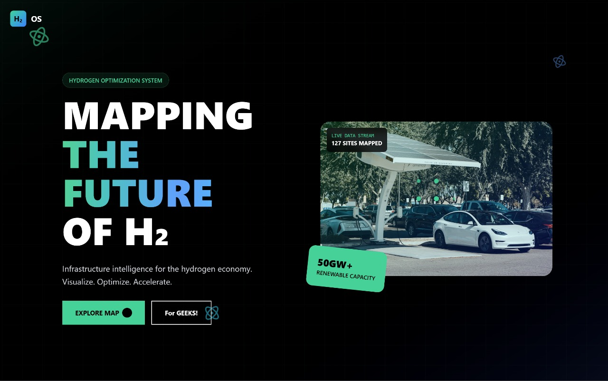
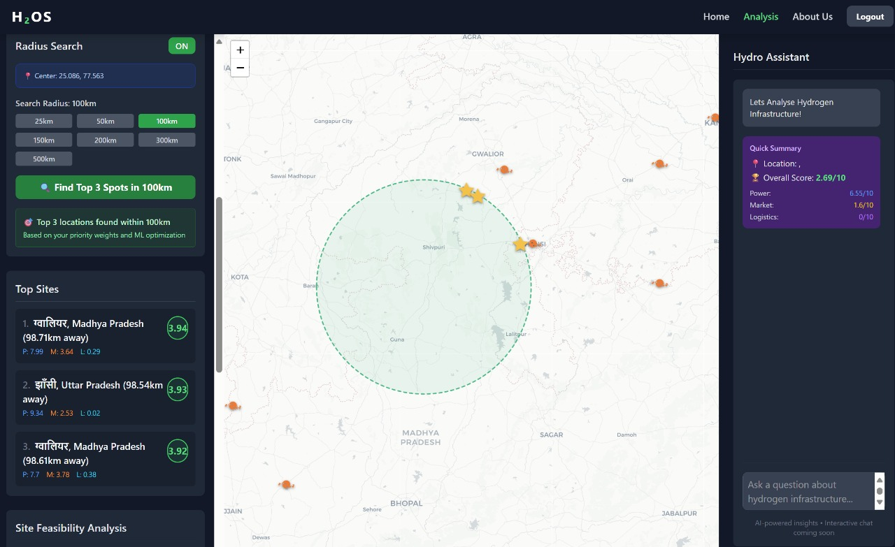

# Green Hydrogen Infrastructure Mapping and Optimization

## 📸 Project Screenshots

### Landing Page


### Interactive Dashboard


## Description
Identifying where to grow the hydrogen ecosystem requires a map-based tool that visualizes all existing/planned assets (plants, storage, pipelines, distribution hubs) and uses data-driven models to guide new investments. This project involves creating an interactive map layered with infrastructure data, renewable energy sources, demand centres, and transport logistics. The tool offers site selection recommendations for new projects based on criteria such as proximity to renewable generation, market demand, regulatory zones, or cost optimization.

## Users
- Urban and regional planners
- Energy companies
- Project developers
- Policy analysts

## Impact
- Directs capital to high-impact, high-yield infrastructure projects.
- Avoids redundant investment, minimizing costs and land use.
- Facilitates coordinated growth of hydrogen networks supporting net zero ambitions.

## Features
- Interactive map visualization of existing and planned hydrogen infrastructure.
- Layered data including renewable energy plants, demand centers, logistics hubs, and regulatory zones.
- Data-driven site selection recommendations based on customizable criteria.
- Real-time feasibility scoring for potential project sites.
- AI-powered reasoning and insights to support decision making.
- RESTful API endpoints for integration and extensibility.

## Technologies Used
- Frontend: React, Leaflet.js, TailwindCSS, Framer Motion
- Backend: Python, Flask, Pandas, NumPy, SciPy
- AI & Optimization: CrewAI multi-agent framework, Google Gemini LLM, Linear Programming
- Data Visualization: D3.js (optional)
- GIS: PostGIS, Mapbox (optional)

## Project Structure
```
Placement-Ke-Pyaase-Hackout25/
├── backend/
│   ├── app/                  # Flask app and API routes
│   ├── config.py             # Configuration
│   ├── requirements.txt      # Python dependencies
│   ├── run.py                # Application entry point
│   ├── supply_chain_optimizer.py  # Core optimization logic
│   └── test_script.py        # Testing utilities
├── frontend/
│   ├── components/           # React components including landing pages and dashboard
│   ├── data/                 # Frontend data files
│   ├── src/                  # Frontend source code
│   ├── package.json          # Node dependencies and scripts
│   └── vite.config.ts        # Vite configuration
└── README.md                 # This file
```

## Setup and Running Instructions

### Prerequisites
- Python 3.8+
- Node.js 16+
- pip and npm package managers
- Google Gemini API key (for AI reasoning)

### Backend Setup
1. Clone the repository:
   ```bash
   git clone https://github.com/your-repo/Placement-Ke-Pyaase-Hackout25.git
   cd Placement-Ke-Pyaase-Hackout25/backend
   ```
2. Create and activate a virtual environment:
   ```bash
   python -m venv venv
   source venv/bin/activate  # Windows: venv\Scripts\activate
   ```
3. Install Python dependencies:
   ```bash
   pip install -r requirements.txt
   ```
4. Set environment variable for Gemini API key:
   ```bash
   export GEMINI_API_KEY=your_api_key_here
   ```
5. Run the backend server:
   ```bash
   python run.py
   ```

### Frontend Setup
1. Navigate to frontend directory:
   ```bash
   cd ../frontend
   ```
2. Install Node dependencies:
   ```bash
   npm install
   ```
3. Start the frontend development server:
   ```bash
   npm run dev
   ```

### Access the Application
- Frontend UI: `http://localhost:5173`
- Backend API: `http://localhost:5000`

## API Endpoints Summary
- `POST /api/optimize`: Calculate opportunity scores with custom weights.
- `GET /api/initial-map-data`: Retrieve all map data in GeoJSON format.
- `POST /api/optimize-grid`: Grid-based optimization returning top locations.
- `POST /api/optimize-point`: Feasibility score for a single coordinate.
- `POST /api/analyze-reasoning`: AI-powered reasoning for scores.
- `POST /api/optimize-radius`: Radius-based optimization for locations.
- `POST /api/analyze-power-supply`: Power supply analysis with AI reasoning.

## How to Use
- Explore the interactive map with layered infrastructure data.
- Adjust weights for power, market demand, and logistics to customize site scoring.
- Click on map locations to get feasibility scores and AI-generated insights.
- Use the API for integration with other tools or custom analysis.

## Team
Placement Ke Pyaase - Hackout25 Hackathon Participants

## License
This project is developed for educational and research purposes as part of the Hackout25 hackathon.

---

**Note:**  
Two placeholder images should be added to this README:
- `landing_page.jpg` for the landing page screenshot.
- `dashboard.jpg` for the interactive dashboard screenshot.
