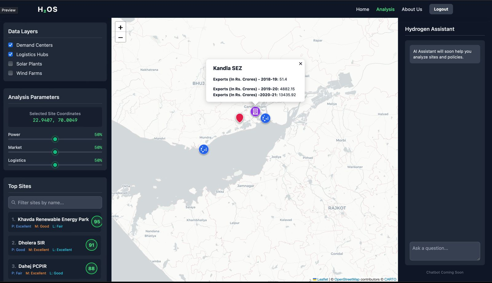

# Green Hydrogen Project Feasibility Analyzer

## Frontend UI Dashboard

### Screenshot (Preview)



## Project Description
A comprehensive supply chain optimization and feasibility analysis system for green hydrogen project placement in India. This platform helps investors, policymakers, and energy companies identify optimal locations for green hydrogen production facilities by analyzing proximity to renewable energy sources, market demand centers, and logistics infrastructure.

## Features and Functionality

### Core Optimization Engine
- **Grid-based Analysis**: Evaluates locations across India using a comprehensive grid system
- **Multi-criteria Decision Making**: Considers power proximity, market access, and logistics infrastructure
- **Weighted Scoring System**: Users can customize importance weights for different factors
- **Real-time Feasibility Assessment**: Provides immediate scoring for any geographic coordinate

### AI-Powered Insights
- **Intelligent Reasoning**: AI agent explains feasibility scores in natural language
- **Data-driven Recommendations**: Provides actionable insights based on optimization results
- **Customizable Analysis**: Adapts explanations based on user priorities and weights

### Interactive API
- **RESTful Endpoints**: Comprehensive API for frontend integration
- **GeoJSON Support**: Returns data in standardized geographic formats
- **Error Handling**: Robust error management and validation

## Technologies and Libraries Used

### Backend Framework
- **Flask**: Python web framework for API development
- **Flask-CORS**: Cross-origin resource sharing support

### Data Processing & Analysis
- **Pandas**: Data manipulation and analysis
- **NumPy**: Numerical computing and array operations
- **Scikit-learn**: Machine learning utilities (Haversine distance calculations)

### AI & Reasoning
- **CrewAI**: Multi-agent framework for AI reasoning
- **Google Gemini**: Large language model for natural language explanations

### Optimization & Mathematics
- **SciPy**: Scientific computing and optimization algorithms
- **Linear Programming**: For supply route optimization

## Project Structure

```
Placement-Ke-Pyaase-Hackout25/
├── backend/
│   ├── config.py              # Application configuration
│   ├── requirements.txt       # Python dependencies
│   ├── run.py                # Application entry point
│   ├── supply_chain_optimizer.py  # Core optimization engine
│   ├── test_script.py        # Testing utilities
│   └── app/
│       ├── __init__.py       # Flask application factory
│       ├── api/
│       │   ├── __init__.py   # API blueprint
│       │   └── routes.py     # API endpoint definitions
│       ├── data/             # Data files directory
│       │   ├── *.csv         # Various data sources
│       │   └── app/data/     # Cleaned and processed data
│       ├── services/
│       │   ├── __init__.py
│       │   ├── optimization_service.py  # Opportunity scoring service
│       │   ├── reasoning_agent.py       # AI reasoning service
│       │   └── api_test.py   # API testing utilities
│       └── utils/
│           ├── __init__.py
│           └── data_loader.py # Data loading and preprocessing
```

## Setup and Running Instructions

### Prerequisites
- Python 3.8+
- pip (Python package manager)
- Google Gemini API key (for AI reasoning)

### Installation
1. Clone the repository
2. Navigate to the backend directory:
   ```bash
   cd Placement-Ke-Pyaase-Hackout25/backend
   ```
3. Install dependencies:
   ```bash
   pip install -r requirements.txt
   ```
4. Set up environment variables:
   ```bash
   export GEMINI_API_KEY=your_api_key_here
   ```

### Running the Application
```bash
python run.py
```

The application will start on `http://0.0.0.0:5000`

### Testing
Run the test script to verify functionality:
```bash
python test_script.py
```

## Data Sources and Preprocessing

### Primary Data Sources
- **Renewable Energy Plants**: Solar and wind power installations across India
- **Demand Centers**: Industrial and commercial zones with hydrogen demand potential
- **Logistics Hubs**: Ports and transportation infrastructure
- **SEZ Data**: Special Economic Zones for industrial development

### Data Processing Pipeline
1. **Data Cleaning**: Removal of incomplete records and standardization
2. **Geocoding**: Conversion of location data to latitude/longitude coordinates
3. **Capacity Normalization**: Standardization of power capacity measurements
4. **Quality Assurance**: Validation of geographic coordinates and data integrity

### Preprocessed Files
- `cleaned_solar_plants.csv`: Processed solar power plant data
- `cleaned_wind_plants.csv`: Processed wind power plant data
- `cleaned_demand_centers.csv`: Processed demand center locations
- `ports.csv`: Logistics hub information

## API Endpoints Summary

### Optimization Endpoints

#### POST `/api/optimize`
Calculates opportunity scores for new hydrogen projects with custom weights.

**Request Body:**
```json
{
  "powerWeight": 0.25,
  "marketWeight": 0.25,
  "opportunityWeight": 0.25,
  "logisticsWeight": 0.25
}
```

#### GET `/api/initial-map-data`
Returns all initial data points for map visualization in GeoJSON format.

#### POST `/api/optimize-grid`
Grid-based optimization returning top N locations based on user weights.

#### POST `/api/optimize-point`
Calculates feasibility score for a single user-defined coordinate.

#### POST `/api/analyze-reasoning`
Generates AI-powered reasoning for feasibility scores.

## AI-Powered Reasoning Agent

### Features
- **Contextual Analysis**: Explains scores based on user priorities
- **Natural Language Output**: Provides human-readable explanations
- **Data Integration**: Combines quantitative scores with qualitative insights
- **Customizable**: Adapts to different weighting scenarios

### Implementation
- Built on CrewAI multi-agent framework
- Integrated with Google Gemini for advanced reasoning
- Provides 2-3 sentence explanations tailored to specific scores

## Frontend UI Dashboard

### Overview

The frontend of the application is built with Next.js, React, and TailwindCSS, offering a clean and interactive interface for exploring green hydrogen infrastructure. The design emphasizes clarity, usability, and data-driven decision-making.

### UI Layout

The application is structured into three main panels:

- **Left Sidebar – Data & Analysis**

  - Data Layers Toggle: Users can switch infrastructure layers on/off, including Demand Centers, Logistics Hubs, Solar Plants, and Wind Farms.

  - Analysis Parameters: Shows the currently selected site coordinates, along with adjustable sliders for Power, Market, and Logistics.

  - Top Sites List: Displays ranked project sites with scores (e.g., Khavda Renewable Energy Park – 95/100), including Power, Market, and Logistics quality labels (Excellent/Good/Fair).

- **Center – Interactive Map**

  - Built with Leaflet.js + OpenStreetMap.

  - Interactive markers for assets (demand hubs, logistics, SEZs, etc.).

  - Clicking a site reveals popup details (e.g., Kandla SEZ export statistics across years).

  - Supports zoom and pan for exploring different regions.

- **Right Sidebar – Hydro (AI Assistant)**

  - Hydro is the built-in AI assistant that helps analyze sites, policies, and investment opportunities.

  - Currently includes an information panel (“Hydro will soon help you analyze sites and policies”) and a chat input box (Chat with Hydro – Coming Soon).

- **Top Navigation Bar**

  - Minimal navbar with Home, Analysis, About Us, Logout.

  - Branding displayed as H₂OS (Hydrogen Operating System).

### Tech Stack

- Framework: Next.js + React

- Styling: TailwindCSS

- Maps: Leaflet.js + OpenStreetMap

- State Management: React hooks (useState, useEffect, useMemo)

- Icons & UI: Lucide-react + custom components


## Team and Contribution

This project was developed as part of Hackout25 hackathon by the "Placement Ke Pyaase" team, focusing on solving real-world energy infrastructure challenges through data-driven optimization and AI-powered insights.

## License

This project is developed for educational and research purposes as part of the Hackout25 hackathon.
